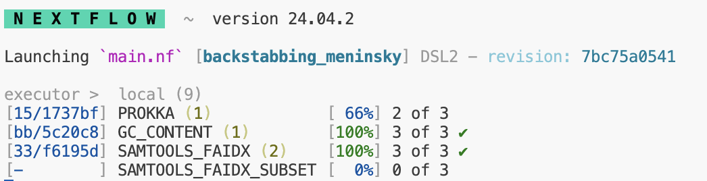

# Week 3: Genome Analytics {-}

## Section Links {-}

[Week 3 Overview]

[Objectives]

[Understanding the staging directory]

[Inspecting the Prokka Output]

[Passing outputs of processes as inputs]

[Basic Local Alignment Search Tool]

[Developing an external script]


## Week 3 Overview {-}

For this week, you will be inspecting the outputs of Prokka, and using the 
annotations generated to extract a specific portion of the genome sequence using
samtools. You will also develop a simple python script that will be incorporated
into your Nextflow pipeline that will calculate a few basic statistics on your
chosen genome (GC content and length).


## Objectives {-}

- Get familiar with the outputs of Prokka and the GFF file

- Use samtools to extract a randomly selected region from a large sequence

- Develop an external script that can be seamlessly incorporated into your workflow

## Understanding the staging directory {-}

As we've mentioned, nextflow will "stage" files for specific processes in their
own directories that are named specially in the `work/` directory it creates.
These names usually follow the pattern of beginning with two letters or numbers,
followed by an underscore, and then followed by a string of letters and numbers.

This is known as a hash and you can think of it as a way of encoding data and
information of arbitrary size to a fixed size. Nextflow will automatically stage
each task in these separate directories for you. The main advantage of this
strategy is that it prevents you from having to worry about file names and file name
collisions since each task is guaranteed to run in its own new directory.

When you run nextflow, you may have noticed that to the left of each process
listed, you can see the location of where nextflow has run said task.



You can navigate to these directories manually to inspect logs, output files, 
or check that the right files are being staged. 

:::{.box .task}
1. Navigate to the directory in `work/` where your Prokka process ran successfully. 
Answer the following question in the provided week3_tasks.Rmd:

    1. Explain the purpose of each file that you find in this directory. You may
    need to look up concepts such as stdout and stderr. 

:::

## Inspecting the Prokka Output {-}

For full details, you can view the [Prokka](https://github.com/tseemann/prokka)
documentation for the exact files it produces. We are going to focus on the GFF
output as that will contain some of the most important annotation information.

As we discussed in lecture, a GFF file contains information used to describe genes
and other features of DNA, RNA or protein sequences. 

:::{.box .task}
1. Navigate to your `results/` directory and find the outputs created by Prokka.
Open up the `<replace_with_your_name>.gff` file and answer the following questions:

    a. Does this file have a regularized format? How would you parse or read this
    file?
    
    b. What information appears to be stored in this file?
    
2. Scroll through the file, and pick a random line where the 7th column is '+'. 
Record the values from the 4th and 5th column, they should both be numbers and 
represent an interval of the genome that has been annotated to some function 
or identity by Prokka. 

3. In your `refs/` directory, create a new text file and call it
`region_of_interest.txt` In this file, it should be a single line with the
information you found above with the following generic format:

    ```
    <name_of_genome>:<value from column 4>-<value from column 5>
    ```

    Or for a specific example:
    ```
    genome_a:100-200
    ```

:::

## Passing outputs of processes as inputs {-}

In nearly all bioinformatics pipelines, you will need to take the outputs from
one tool and input them into another. 

Last week, you generated a module and process to create a genome index for your
chosen genome. Now, we wish to use this index to enable us to quickly access
random regions of the genome and extract their sequence. We will directly pass
the outputs from this process to another process which will use the newly
created index.

For most index files in bioinformatics, they will be named the same as the file
they are associated with but with an additional extension indicating that it's 
an index. For our example, we will have two files including the original FASTA
file:

```
genome.fna
genome.fna.fai
```

Most utilities that use this index file will by default assume that the index
and the original file are located in the same place. Our new process will call
mostly the same `samtools faidx` command, but now by including the index, it
will extract out the sequence associated with the coordinates provided in our
`region_of_interest.txt`

:::{.box .task}
1. Generate a new `main.nf` script in the `samtools_faidx_subset` directory
under `modules`. You may copy your `main.nf` from the `samtools_faidx` directory
as the inputs, outputs, and commands will all be largely similar. Remember that
the both the original file and index need to be in the same location for most
tools to utilize it. 

You can pass the outputs from your previous `samtools_faidx` process
as input to this one. You will have one additional input which will be the
`region_of_interest.txt` you generated previously. By default, most samtools
utilities print their results to stdout. Use the `>` tool to redirect the output
to a file named `region.subset.fna`.
:::

## Basic Local Alignment Search Tool {-}

For those not familiar, BLAST is an algorithm developed by the NCBI that enables
searching for short sequence matches of a subject sequence of interest against a
large library of known and identified sequences present in our collective
databases. It is a remarkable tool that will take a short nucleotide or protein
sequence and return some of the most similar sequences, which allows us to make
strong inferences and conclusions about the potential identity and origin of our
sequence of interest. It is a heuristic algorithm that works by first finding
short matches between two sequences. By its nature, it is not designed to find
or ensure it returns optimal alignments, and instead prioritizes speed. A quick
google search will lead you to the BLAST website.

:::{.box .task}
1. Please select the nucleotide blast option and open the file you created named
`your_genome.region.subset.fna`. Copy the sequence found within that file into
the query section of BLAST and leave all other options at default. Answer the
following question in your provided week3_tasks.Rmd:

    a. Please take a screenshot of the BLAST results returned from your query.
    What are some of the possible alignments of your sequence of interest? Are
    there are any commonalities in the organisms found if you see multiple
    equally valid results?


    b. Just for fun: feel free to inspect more of the results from Prokka and
    query potential matches using BLAST. Can you guess the original identity of
    the genome you chose?
:::    

## Developing an external script {-}

Many times in bioinformatics pipelines, we will need to run a custom script that
will perform a specific analysis or operation. For this pipeline, we wish to
calculate some basic statistics about the chosen genome. We will take advantage
of the fact that FASTA files are simple text files with a defined format that
can be easily parsed.

Nextflow has made the incorporation of scripts into workflows very simple. You
can place your external scripts in the `bin/` directory and nextflow will handle
staging the `bin/` directory and adding the script to path when it executes. You
will need to include a [shebang
line](https://en.wikipedia.org/wiki/Shebang_(Unix)) and change the script
permissions to be executable prior to running your workflow.

Take a look at the provided skeleton of a script in `bin/` named
`genome_stats.py`. Examine lines 1-20, and you may also find this
[documentation](https://docs.python.org/3/library/argparse.html) helpful. This
script utilizes `argparse`, a library meant to make it simple to write
user-friendly command-line interfaces. This is one of the many methods by which
tools and scripts enable you to set different flags or options at runtime (e.g.
--output or -p).

:::{.box .task}
In the provided week3_tasks.Rmd, please answer the following questions:

    1. How would you change this argparse code to accept a list of file inputs?
    
    2. Why are we going to the trouble of making a separate script and nextflow
    module to run this specific code?

:::


You will develop your code to parse the genome FASTA you were provided and the
nextflow module accompanying this script will simply be responsible for passing
it the correct input (your FASTA file) and specifying the output file. 

:::{.box .task}
1. Write valid python code below line 20 in the provided script. You may do this
with basic python functionalities or attempt to use [Biopython](https://biopython.org/). 
Your code should do the following:

    a. Read in the FASTA file 
    b. Parse the sequence correctly and return the GC
    Content as a percentage and the length of the genome. 
    c. Output these two values to separate lines in a  new file, you may include
    some text explaining what each value represents (i.e. GC Content: 64%)
    
2. Make a new directory in `modules` entitled `genome_stats` and create a
`main.nf`. If using biopython, make an appropriate YML environment specification
for biopython. If only using basic python, make a YML environment specification
with python installed. You can have the inputs be the same shape and structure
as the `fa_ch`. You will need to specify how you want the output file named. 
The shell/script portion will be the command for executing the associated `.py`
script and providing it the appropriate inputs as specified by `argparse`. Please
write the new file to the `results/` directory using `publishDir`.

3. When your script is functional and your associated nextflow module complete,
run Nextflow once more to generate the text file containing the two genome
statistics requested. 

:::

## Week 3 Tasks Summary {-}

1. Select a region of interest from the GFF generated from the output of Prokka
and encode the information as specified in a new file `refs/region_of_interest.txt`

2. Generate a new nextflow module that takes the outputs of the `samtools_faidx`
process as inputs along with your `refs/region_of_interest.txt`. This module
should run samtools faidx to extract the specific sequence specified in your text 
file from the full genome file. Place this sequence in a new FASTA file called
`region.subset.fna`

3. Explore the use of [BLAST](https://blast.ncbi.nlm.nih.gov/Blast.cgi) and utilize
it to query the sequence you extracted. Take a screenshot of the results and make
sure to answer the associated questions. 

4. Develop the included `genome_stats.py` script to successfully parse the genome
FASTA file and calculate the GC content (as a percentage of total) and the length 
of the sequence. Simultaneously, develop a new nextflow module that will call
the script and provide the appropriate inputs on the command line. This script
should write the results to a new text file named as you choose. 
