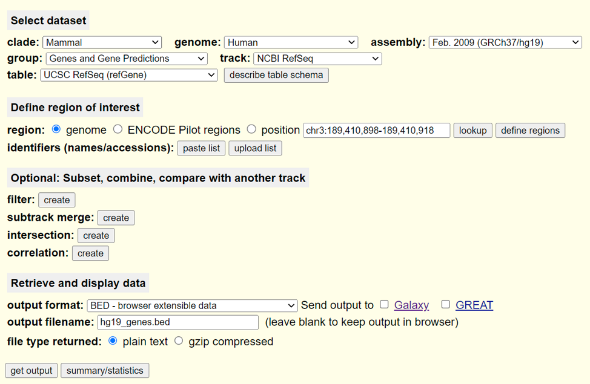

# Project 3: ChIPseq analysis of the human transcription factor Runx1 {-}
Similar to advancing gene expression quantification from microarrays to RNA-seq,
next-generation sequencing also revolutionized other wet lab assays that examine
nucleotides by making them (relatively) unbiased and high-throughput. One such
set of technologies are protein-DNA binding assays including ChiP-qPCR and
ChIP-ChIP which use antibodies and immunoprecipitation to capture chromatin
bound by a specific protein of interest. Chromatin Immunoprecipitation
Sequencing (ChIP-seq) is a technique that identifies genome-wide DNA binding
sites with transcription factors and other proteins of interest by sequencing
the DNA fragments isolated from protein-DNA complexes.

Barutcu et al. (2016) used RNA-seq, ChIP-seq, and HI-C to investigate the role
of Runx1 in the MCF7 cell line, a model line used for the study of breast
cancer. In this project, we will reproduce several results from Supplementary
Figure 2 and Figure 1, which comprise common preliminary analyses of ChIP-seq
data. Each group will process the ChIP-seq data from raw reads to called peaks,
incorporate the provided RNA-seq data and ultimately attempt to reproduce the
findings found in the paper.

Upon completion of project 3, students will be able to do the following: 

* Align reads to the human reference genome using BowTie2 
* Perform peak calling analysis and annotation with HOMER
* Perform motif analysis using HOMER 
* Generate genomic visualizations using DeepTools, and IGV 
* Understand the basics of how to use Snakemake to automate a simple workflow

Please note that the methods for the original paper are ambiguous in important
areas. For this project, on occasion, you will be asked to define certain
parameters and explain your choice. It is important to remember that even if the
authors had specified a specific value for certain parameters, that does not
mean that is the single correct option. We base our choice of these parameters
on our background knowledge and rational assumptions. Do your best to pick
reasonable values and justify them.

Contents:

* 1. Read the paper, and your sections' instructions and create a workflow
     diagram 
* 2. Read Alignment and Mapping Statistifcs 
* 3. Peak Calling and Annotation using Homer 
* 4. Generating bigWig file for correlation analysis and visualization 
* 5. Integration with RNAseq data and counting peaks associated with DE genes

## 1. Read the paper and create a workflow diagram for your role {-}

**Everyone**
To begin, you should read the original paper to gain a sense for what
overarching biological question they were hoping to answer as well as what
methods they employed to do so. We have briefly explained the general structure
of a workflow diagram and shown a few examples in lecture. We have provided you
a skeleton for how a high-level workflow diagram for your section should be
structured. Read through your section's instructions and attempt to fill in the
diagram with the outlined steps keeping their dependencies in mind (i.e. which
steps need to occur before others can). For your report, you will have a copy of
the entire workflow from start to finish for all roles. In future projects, you
will be asked to make these workflows for your individual role and connect them
with your group to create a workflow for the entire project. (These workflow
diagrams may be made in PowerPoint or any other suitable graphics illustrator)

## 2. Read Alignment and Mapping Statistics {-}

**Lead Role: Data Curator**
The data you will be working with consists of two ChIP-seq experiments,
typically termed the IP or pulldown samples, with matching input controls for a
total of 4 samples or FASTQ files. We have downloaded and processed three out of
the four files already, and you will be responsible for downloading the last and
generating a snakemake workflow that will process it in the same manner as the
others. Your first step will be to download GSM1942111 (SRR2919475) from the GEO
accession GSE75070. The sample itself is referred to as the 'MCF-7 wildtype RUNX1
ChIPseq Replicate1 Pulldown'. You may use whatever strategy you like to download
the appropriate FASTQ file. Load all of the necessary components in modules
before running snakemake. Though there are many workflow management tools, we
will be using Snakemake as its syntax is highly similar to Python, a programming
language you already have experience using. We have provided a skeleton
snakemake file that will demonstrate and explain some of the basic concepts.
Utilize information from the provided example snakefile called example.snake as
well as the official Snakemake tutorial
(https://snakemake.readthedocs.io/en/stable/tutorial/basics.html) to generate a
Snakemake workflow to run all of the steps below: 

1. Run FASTQC on the FASTA file

2. Run Trimmomatic with the default settings suggested by Trimmomatic. Use the
   adapter fasta file we have provided for you located here:
   /projectnb/bf528/proj3/TruSeq3–SE.fa
   
3. Align the FASTQ file against the provided hg19 human genome reference using
   BowTie2. The original publication did not specify if they adjusted any of the
   many optional parameters available. The BowTie2 manual describes several
   “pre-set” options that adjust various alignment parameters. You may look into
   and choose one that you think is appropriate or you may use default parameters.
   The pre-built index may be found here:
   /projectnb/bf528/proj3/references/GRCh37.p13.genome.bowtie

4. Use Samtools flagstat to output a short summary of mapping statistics to a 
   .txt file 

5. Use Samtools sort to produce a sorted BAM file Run Samtools index on the 
   sorted BAM file to create a .bai (BAM index) file 
   
6. Run MultiQC to produce a convenient report of the quality metrics from all 
   steps 
   
   We have provided you with the alignments for the other 3 samples as BAM files in
   `Directory here`. Separately, use Samtools to output the same mapping statistics
   as in 2.4. Create a table similar to the one seen in Supplemental Figure 2b.

7. Run Samtools flagstat to produce mapping statistics for the other provided 
   files. You are welcome to incorporate this into your Snakemake workflow, but 
   it is not necessary. 
   
**Deliverables:** 

* A sorted BAM file of alignments for SRR2919475 

* A BAM index for the sorted BAM file 

* Table of mapping statistics for all 4 BAM files 

* Relevant FASTQC quality plots from MultiQC

* The completed Snakemake workflow (snakefile) that produces the above 
  deliverables
  
## 3. Peak Calling and Annotation using Homer {-}

**Lead Role: Programmer**
We will now use the alignments from BowTie2 to perform peak calling using the
program HOMER. The data curator will provide you with one of the sorted, indexed
BAM files and we have provided you with the others. You will ultimately use
these BAM files to first generate TAG directories (HOMER re-formats some of the
BAM data into a unified format it uses for the rest of its utilities), call
peaks, produce a set of “reproducible peaks” and remove blacklisted
signal-artifact regions from your peak list. After generating tag directories
for each BAM file, you will run the findPeaks utility twice to produce two sets
of peak files for each experiment (match the replicate numbers for the IP and
Inp). The authors of the publication performed the ChIP-seq analysis separately
for each experiment and then generated a single set of “reproducible” peaks
(Supp. Fig 2a). They do not disclose in their methods what procedure was used to
generate this set. In general, there are two main ways that “reproducible” peaks
are chosen for ChIP-seq experiments: 1. Irreproducible Discovery Rate (IDR), and
2. Intersections / Unions of peaks. You will use the latter strategy and
Bedtools to produce your own set of  “reproducible peaks” from the two replicate
experiments provided. Once you have generated this list of “reproducible” peaks,
you will remove any known blacklisted signal-artifact regions, annotate your
filtered peaks to their nearest genomic feature, and perform motif finding to
analyze what other cofactors may be binding in your discovered peaks.

1. Load the require modules: Homer, Bedtools 

2. Generate TAG directories using the makeTagDir command in HOMER. You can run 
   this step with default parameters for every option. You may refer to the 
   official instructions found here: http://homer.ucsd.edu/homer/ngs/tagDir.html
   
3. Run the findPeaks utility in HOMER.The official documentation for the 
   findPeaks utility may be found here: http://homer.ucsd.edu/homer/ngs/peaks.html. 
   Make sure you use the `-style factor` mode. N.B. You will want to run this 
   twice (once for each pair of IP and Inp replicates). 

4. The findPeaks utility outputs a HOMER formatted text file. Use the pos2bed 
   HOMER utility to convert your peak files to BED files. 

5. You will have two sets of peak BED files from the previous steps. For this 
   step, using only Bedtools, produce a single set of “reproducible” peaks in 
   BED format. Justify and explain your strategy for defining “reproducible” 
   peaks in your written report. Create a simple venn diagram indicating the 
   original number of peaks called in each replicate, and the number of 
   “reproducible” peaks you determined. See Supplemental Figure 2c for reference. 

6. Use BedTools to remove any peaks from your list based on the provided 
   blacklist located here: /projectnb/bf528/proj3/reference/hg19_blacklist.bed. 
   Make sure to note in your written report how many peaks remain and were 
   removed from your list of “reproducible” peaks after filtering using this 
   blacklist. 

7. Using the annotatePeaks.pl utility in HOMER, annotate your list of filtered
   “reproducible” peaks to their nearest genomic feature. This utility will 
   generate a simple TSV / .txt file of the results. From the annotations, 
   produce a simple, labeled pie chart showing the percentage of “reproducible” 
   peaks falling into the known genomic region features (intron, intergenic, TSS, TTS, etc.). 
   Refer to the original figure 2a in the paper. 

8. The authors of the paper used MEME-ChIP to perform motif finding using their 
   “reproducible peaks” but they do not disclose the specific parameters used to
   run the analysis. Additionally, MEME–ChIP requires the input file to be a 
   FASTA file of the extracted genomic regions covered by the peaks. For our 
   purposes, we will use the findMotifsGenome.pl utility in HOMER to perform 
   motif finding using your “reproducible peaks” BED file after it has been 
   filtered using the ENCODE blacklist. The official documentation for the
   findMotifsGenome utility is here: http://homer.ucsd.edu/homer/ngs/peakMotifs.html.
   

**OPTIONAL:** If you are looking for an extra challenge, you may instead attempt
to use MEME-ChIP to perform motif finding as they did in the paper. In general,
you will have to figure out how to do the following:

1. Extract chromosome sizes from the hg19 reference 
2. Determine the average size of your peaks 
3. Use your chromosome sizes, the average size of your peaks, and BedTools to 
   make a BED file containing all of your peaks expanded to around ~500bp in size. 
4. Extract the DNA sequences from the regions in your BED file from
   the provided bgzipped genomic FASTA reference for hg19. 
5. Run MEME-ChIP using your fasta file of DNA sequences covered by your peaks

**Deliverables:** 

* A venn diagram indicating how many peaks were discovered in each
  replicate experiment with the intersection representing the number of
  “reproducible” peaks your strategy resulted in. 
  
* A single BED file of “reproducible” peaks from the two replicate experiments 
  filtered for signal–artifact regions 
  
* A txt file of your filtered “reproducible” peaks annotated to their nearest 
  genomic feature A pie chart showing the relative proportions of “reproducible”
  peaks annotated to genomic features (intron, intergenic, TSS, TTS, etc.) 
  
* Summarize the top ten enriched motifs from the output of
  HOMER or MEME-ChIP.  Both of these utilities output a directory containing
  multiple files of results.

## 4. Generating bigWig file for correlation analysis and visualization 

**Lead Role: Analyst** 
DeepTools is a collection of utilities that perform various helpful functions
especially in the context of ChIP-seq and genome-wide sequencing technologies.
You will be using these utilities to generate a heatmap of clustered correlation
metrics between all the samples, normalized coverage tracks for visualization,
and the signal coverage plot across the TSS and TTS of all hg19 genes. We will
first generate bigWig files of each BAM file to calculate the similarity between
all of these files based on their binned coverage. The bamCoverage utility will
create bigWig files, which essentially discretizes the genome into evenly sized,
consecutive bins and counts the number of reads falling into each one. We will
then calculate the pairwise correlation between the bins of samples and display
this information as a clustered heatmap. Our a priori expectations are that our
IP or pulldown samples are highly similar to each other, our input samples are
similar to each other, and the IP and input samples are less similar when
compared. We will then use the bigWig files to plot the normalized signal
relative to the transcription start site (TSS) and transcription termination
site (TTS) of all genes in the hg19 reference. This type of plot is often
helpful for determining the potential regulatory mechanisms of the factor of
interest. In our case, transcription factors are known to directly bind DNA and
are commonly found located in the promoter region (near the TSS) where they will
typically recruit other cofactors, chromatin remodelers or components of the RNA
polymerase complex II to regulate gene expression. If we inspect the plot in
figure 1c, we can see that the signal distribution for the Runx1 ChIP is
primarily concentrated in the promoter-TSS region of genes.

1. Load the required modules: DeepTools 

2. Use the bamCoverage utility in DeepTools to generate a bigwig file for each 
   sorted BAM file you received from the data curator. Generate a bigWig file for
   each of the 4 BAM files provided. 

3. Once you have produced all of the bigwig files, use the
   multiBigWigSummary utility and the plotCorrelation utility to produce a 
   clustered heatmap of the Pearson correlation values between all the samples.
   Refer to their respective manual pages here for help:
   https://deeptools.readthedocs.io/en/develop/content/list_of_tools.html. 
   Compare your figure to the one found in the paper Supp Fig 2b. Make sure to 
   answer the following questions in your written report: How similar are your 
   correlation values? What could cause these differences to arise? Do they 
   affect the overall conclusion drawn from this particular figure? What is the 
   overall conclusion made from this figure by the authors? 

4. Navigate to the UCSC Table Browser, use the following settings to extract a 
   BED file listing the TSS/TTS locations for every gene in the hg19 reference:

On the following page, do not change any options and you will be prompted to
download a BED file containing the requested information. Put this BED file into
your working directory on SCC. This is a simple use case, but the UCSC table
browser and UCSC genome browser are incredibly powerful tools and repositories
for genome-wide sequencing data. 

5. Using the bigwig files for the IP samples generated in step 1 and the BED 
   file of hg19 genes from step 3, run the computeMatrix utility in DeepTools in
   the scale-regions mode twice (once for each IP sample). **N.B.** Remember 
   that we are trying to reproduce the figure from the paper, be sure to include
   regions in a 2kb window up- and downstream of the TSS and TTS, respectively. 
   You may leave every other parameter at its default value. Justify any changes
   in parameters if you do alter them. 

6. You will have run computeMatrix twice (on both replicates) and generated two 
   matrices of values. Run plotProfile on each matrix to generate a visualization 
   of the Runx1 signal coverage across hg19 genes.

**Deliverables:**

* A heatmap showing the clustered correlation values for input and IP samples 
  akin to Figure Supp2b. 
  
* Two plots (one for each IP replicate) showing the signal coverage 
  for Runx1 across hg19 genes using the TSS and TTS as reference points

## 5. Integration with HIC and RNAseq data

**Lead Role: Biologist**
ChIP-seq data is often used in tandem with RNA-seq results to provide a direct
link between the physical binding of a factor and its subsequent effect on gene
expression. Put simply, if we observe binding of a transcription factor in an
important regulatory region of a gene of interest and we observe that the
expression of this gene is altered when we knockout this transcription factor,
we can can make the conclusion that the transcription factor is likely directly
involved in the regulation of the expression of the gene of interest. Navigate
to the GEO accession page for this publication (GSE75070).

1. Download the DESeq2 results (GSE75070_MCF7_shRUNX1_shNS_RNAseq_log2_foldchange.txt.gz).
   Apply the same filters and cutoffs as specified in the methods. How many DE 
   genes do you find? Do they match the numbers reported in the paper? 

2. Using the list of DE genes found in step 1 and the annotated peak file 
   provided to you by the programmer, recreate figure 1f and produce a stacked 
   barchart or similar figure showing the proportions found from your results. 
   **N.B.** In their figure 1f, they calculate one set of numbers relative to 
   the TSS and another set relative to the ‘whole body’ of the gene. For our 
   case, just use the distance to TSS found in the annotations file. 

3. Next, we will be generating visualizations of the peaks found in the promoter
   regions of two key genes reported by the paper. Download IGV
   (https://software.broadinstitute.org/software/igv/) or use the newly added 
   web-only interface (https://igv.org/app/) to load all of your bigwig tracks 
   separately as well as the BED file of “reproducible peaks” on a genome 
   browser. Navigate to the two genes mentioned specifically in the paper, MALAT1
   and NEAT1. Make sure to answer the following questions in your written report:
   Do you see the same general results as in figures 2d and 2e? What does this
   figure imply? Do you agree with the conclusions made by the authors? **N.B.**
   Although we have discouraged you from generating figures using screenshots, on
   this one occasion, we will encourage you to take a screenshot of each of these
   loci to generate your figures. 

4. Finally, we are going to attempt to reproduce the plot shown in figure 3d. 
   This is a common representation of HI-C data where the frequency of 
   interaction (commonly interpreted as the “strength” of the interaction) 
   between two genomic bins is visualized as a heatmap. This is done for every 
   pair of bins along a region, in this case, they chose a 5.3 megabase stretch 
   on the p arm of chromosome 10. Although this plot looks complicated, it is in
   essence, a heatmap of the pairwise interaction matrix for all of the listed 
   bins that has been cropped to only show the upper triangle above the diagonal 
   (since the lower triangle is the same), rotated 45 degrees, and superimposed 
   over the genomic track. Navigate to the GEO page for this experiment, 
   download the appropriate processed HI-C data
   (GSE75070_HiCStein-MCF7-shGFP_hg19_chr10_C-40000-iced.matrix.gz) and do your
   best to recreate this heatmap. You do not need to crop the heatmap or rotate 
   it.

**Deliverables:** 

* A stacked barchart akin to figure 2d showing the percentage of DE genes that 
  have a peak within +/- X distance of the TSS 
  
* A heatmap of the HI-C data for the first 5.3mb of Chromosome 10. **N.B.** You 
  do not need to make it a triangle or rotate it. 
  
* IGV visualization of the NEAT1 TSS with bigWig tracks for all 4 samples, and 
  the BED file of reproducible peaks 
  
* IGV visualization of the MALAT1 TSS with bigWig tracks for all 4 samples, and 
  the BED file of reproducible peaks
