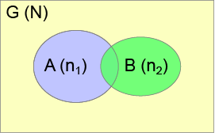
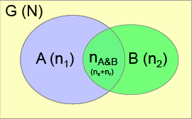

Consider a differential expression experiment where two different datasets are used to identify DE genes. The DE genes from each experiment may be depicted as subsets (A and B) of all possible genes (G), as depicted in Figure 1. We indicate the number of genes in the sets A, B, and G as $n_1$, $n_2$, and $N$, respectively.

G represents the space of all possible genes. "All possible genes" may mean different things based on the context. For example, not every gene will be detected in an RNA-Seq experiment, and so you could argue that $N$ should be the number of genes detected, rather than the number of genes in the whole genome. Without a priori knowledge like this, $N$ should be set to the number of genes in the genome. Regardless, for genome-wide experiments, setting $N$ to the total number of genes in the genome is usually a defensible choice.

{width=25%}

If you threw a dart at Figure 1 (and were guaranteed to hit it), the probability of hitting the area of A is $p_A = n_1/N$, and likewise the probability of hitting B is $p_B = n_2/N$. It follows that the probability of hitting the intersection is $p_{A\cap B} = p_Ap_B = (n_1/N)(n_2/N)$. Therefore, the number of genes that corresponds to the intersection is $n_{A\cap B} = Np_{A\cap B}$ (they use $n_0$ in the text).

If A and B are independent, there is still some probability they will overlap by chance. This probability is proportional to the size of the sets, where larger sets will result in a higher probability of overlap by chance, since they comprise a larger proportion of the overall set G. Consider Figure 2, where the size of the sets, and therefore the size of the intersection, is enlarged compared with Figure 1. Some number $n_r$ of the intersecting genes have occurred by chance. The total number of observed intersecting genes is therefore composed of a "background" part $n_r$ and a "true" part $n_x$ (they use $x$ as $n_x$ in the text), $n_{A\&B} = n_r + n_x$.

{width=25%}

Since the probability of observing overlap by chance is dependent upon the size of the sets $n_1$ and $n_2$, the authors reason that they can compute $n_x$ by examining the probability of intersection for the set of genes that results after removing the size of the "true" overlap.

$$ n_0 = n_x + \frac{(n_1 - n_x)(n_2 - n_x)}{N-n_x} $$

Since $n_0, n_1, n_2,$ and $N$ are known, we can solve this equation for $n_x$ to find the background corrected number of "true" overlapping genes.

$$ n_x = \frac{Nn_0-n_1n_2}{n_0+N-n_1-n_2} $$

In other words, the number of genes we expect to overlap by chance depends upon the number of total genes, the size of the observed overlap, and the size of each set.

Note the effect of background correction is subtle for small values of $n_1$ and $n_2$. Below are plots of observed ($n_{A\cap B}$) versus "true" overlap ($n_x$) using the formula presented in the paper for different values of $n_1$ and $n_2$, given a constant $N$ of 20,000 genes.

```{r echo=FALSE}
library(ggplot2)

f.x <- function(n0,n1=3000,n2=5000,N=20000) {
  x <- (n0*N-n1*n2)/(n0+N-n1-n2)
  if(x <= n0) {
    x
  } else {
    NA
  }
}

do.plot <- function(n1) {
  n0 <- seq(1,n1)
  N <- 20000
  plot(n0,
       vapply(n0,function(x) f.x(x,n1,100,N),0),
       type='l', lwd=2,
       xlab='Observed overlap', ylab='True intersection',
       col='red',
       xlim=c(0,n1),
       ylim=c(0,n1)
  )
  lines(n0,
        vapply(n0,function(x) f.x(x,n1,1000,N),0),
        type='l', lwd=2,
        col='blue'
  )
  lines(n0,
        vapply(n0,function(x) f.x(x,n1,5000,N),0),
        type='l', lwd=2,
        col='green'
  )
  lines(n0,
        vapply(n0,function(x) f.x(x,n1,10000,N),0),
        type='l', lwd=2,
        col='grey'
  )
  lines(n0,n0,col="grey",lty=2)
  lines(n0,rep(0,length(n0)),col="grey",lty=2)
  legend(1,n1,legend=c(
    "Identity/Zero line",
    paste0("n1=",n1,", n2=100"),
    paste0("n1=",n1,", n2=1000"),
    paste0("n1=",n1,", n2=5000"),
    paste0("n1=",n1,", n2=10000")
  ),
  col=c("grey","red","blue","green","grey"),
  lty=c(2,1,1,1,1)
  )
}
```

```{r fig3, fig.height=4}
fig3 <- do.plot(100)
```

```{r fig4, fig.height=4}
fig4 <- do.plot(1000)
```

```{r fig5, fig.height=4}
fig5 <- do.plot(10000)
```